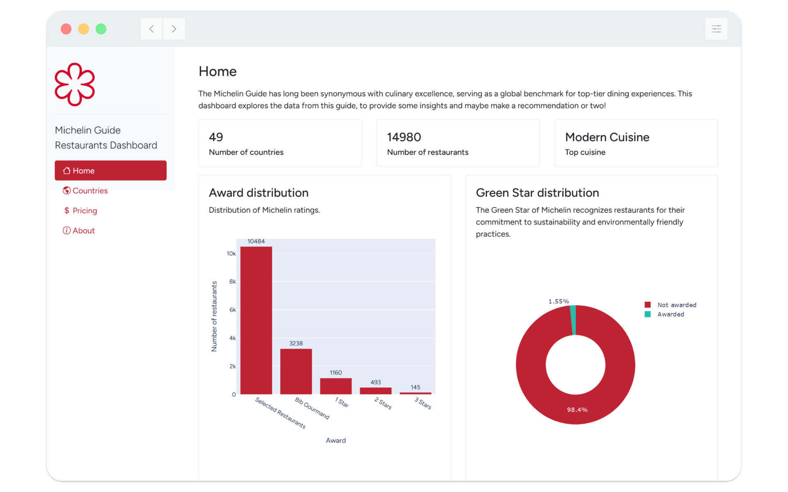

<!-- PROJECT LOGO -->
<br />
<div align="center">
  <a href="https://github.com/othneildrew/Best-README-Template">
    
  </a>

  <h3 align="center">Michelin Guide Restaurants Dashboard</h3>

  <p align="center">
    Explore top-rated culinary experiences with interactive insights, Scraped directly from the Michelin Guide website.
    <br />
    <br />
    <strong>Part of the Plotly Dash
    <a href="https://community.plotly.com/t/autumn-app-challenge/87373">Autumn App Challenge 2024 »</a>
    </strong>
  </p>
</div>

<!-- TABLE OF CONTENTS -->
<details>
  <summary>Table of Contents</summary>
  <ol>
    <li>
      <a href="#about-the-project">About The Project</a>
      <ul>
        <li><a href="#built-with">Built With</a></li>
      </ul>
    </li>
    <li>
      <a href="#getting-started">Getting Started</a>
      <ul>
        <li><a href="#prerequisites">Prerequisites</a></li>
        <li><a href="#installation">Installation</a></li>
      </ul>
    </li>
    <li><a href="#usage">Usage</a></li>
    <li><a href="#contributing">Contributing</a></li>
    <li><a href="#license">License</a></li>
    <li><a href="#contact">Contact</a></li>
  </ol>
</details>


<!-- ABOUT THE PROJECT -->
## About The Project
<div align="center">
    
</div>

Some of the visualizations available:

* **Geographical Distribution**: A map showing the location of Michelin-starred restaurants.
* **Awards Distribution**: Breakdown of distribution of Michelin rating (also per country).
* **Cuisine Popularity**: Count of restaurants by cuisine type.
* **Price Distribution**: Number of restaurants in each price category.
* **Green Stars**: Distribution of restaurants that have earned the Green Star.
* **Top Locations**: Cities with the most Michelin-starred restaurants.
* **Top Countries**: Countries with the most Michelin-starred restaurants.

There are also some features which utilize an LLM (an OpenAI API key is needed).

* **LLM Analysis**: Ask general questions about the data, which is then retrieved using an SQLite database.
* **Recommendations**: Ask for restaurant recommendations which certain constrains and requests.

<p align="right">(<a href="#readme-top">back to top</a>)</p>

### Built With

This project has been built using Python and the Plotly Dash framework.

* [![Python-shield][Python-shield]][Python-url]
* [![Plotly][Plotly-shield]][Plotly-url]

<p align="right">(<a href="#readme-top">back to top</a>)</p>


<!-- GETTING STARTED -->
## Getting Started

To get a local copy up and running follow these simple example steps.

### Prerequisites

Please make sure to have the following prerequisites installed.
* Python 3.11 or greater
* Poetry

### Installation
To set up the project, ensure you have Python 3.11+ installed. Follow these steps:

Clone the repository:

```shell
git clone https://github.com/niekvleeuwen/michelin-guide-restaurants-dashboard.git
cd michelin-guide-restaurants-dashboard
```

Install dependencies using Poetry:

```shell
poetry install
```

Then enter the created virtual environment:

```shell
poetry shell
```

Next, install the pre-commit hooks
```shell
pre-commit install
```

Copy the `.env.dist` file to `.env` and enter in the requested variables.

<p align="right">(<a href="#readme-top">back to top</a>)</p>

<!-- USAGE EXAMPLES -->
## Usage

The program can be executed using:

```shell
python -m dashboard.main
```

<p align="right">(<a href="#readme-top">back to top</a>)</p>

<!-- CONTRIBUTING -->
## Contributing

Contributions are what make the open source community such an amazing place to learn, inspire, and create. Any contributions you make are **greatly appreciated**.

If you have a suggestion that would make this better, please fork the repo and create a pull request. You can also simply open an issue with the tag "enhancement".
Don't forget to give the project a star! Thanks again!

1. Fork the Project
2. Create your Feature Branch (`git checkout -b feature/AmazingFeature`)
3. Commit your Changes (`git commit -m 'Add some AmazingFeature'`)
4. Push to the Branch (`git push origin feature/AmazingFeature`)
5. Open a Pull Request

<!-- LICENSE -->
## License

Distributed under the MIT License. See `LICENSE.txt` for more information.

<p align="right">(<a href="#readme-top">back to top</a>)</p>

<!-- CONTACT -->
## Contact

Niek van Leeuwen - [LinkedIn](https://www.linkedin.com/in/niek-van-leeuwen/) - ik@niekvanleeuwen.nl

Project Link: [https://github.com/niekvleeuwen/michelin-guide-restaurants-dashboard](https://github.com/niekvleeuwen/michelin-guide-restaurants-dashboard)

<p align="right">(<a href="#readme-top">back to top</a>)</p>

<!-- MARKDOWN LINKS & IMAGES -->
[Plotly-shield]: https://img.shields.io/badge/-Plotly-4E84C4?style=for-the-badge&logo=plotly&logoColor=white
[Plotly-url]: https://dash.plotly.com/
[Python-shield]: https://img.shields.io/badge/python-3670A0?style=for-the-badge&logo=python&logoColor=ffdd54
[Python-url]: https://www.python.org/